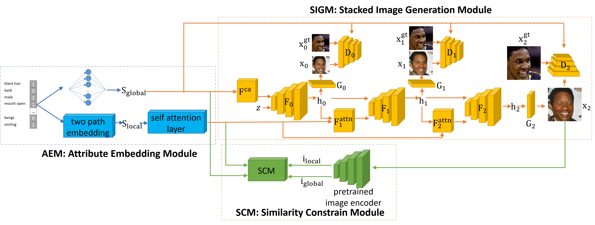

# Attributes Aware Face Generation with Generative Adversarial Networks

This paper has been accepted by ICPR2020.

This repository is an official implementation of the paper [Attributes Aware Face Generation with Generative Adversarial Networks](https://arxiv.org/abs/2012.01782).
## Model

## Abstract
Recent studies have shown remarkable success in face image generations. However, most of the existing methods only generate face images from random noise, and cannot generate face images according to the specific attributes. In this paper, we focus on the problem of face synthesis from attributes, which aims at generating faces with specific characteristics corresponding to the given attributes. To this end, we propose a novel attributes aware face image generator method with generative adversarial networks called AFGAN. Specifically, we firstly propose a two-path embedding layer and self-attention mechanism to convert binary attribute vector to rich attribute features. Then three stacked generators generate $64 \times 64$, $128 \times 128$ and $256 \times 256$ resolution face images respectively by taking the attribute features as input. In addition, an image-attribute matching loss is proposed to enhance the correlation between the generated images and input attributes. Extensive experiments on CelebA demonstrate the superiority of our AFGAN in terms of both qualitative and quantitative evaluations.

## Usage

### Train
    cfg/CelebA_AFGAN.yml
        TRAIN.FLAG: Frue

    python main.py --cfg=cfg/CelebA_AFGAN.yml --gpu=0 --data_dir=XXX

### Test
    cfg/CelebA_AFGAN.yml
        TRAIN.FLAG: False

    python main.py --cfg=cfg/CelebA_AFGAN.yml --gpu=0 --data_dir=XXX

## Model
We have uploaded the model of attribute classifier (`AlexNet_epoch_99.pth`) to [google drive](https://drive.google.com/file/d/15SdegxTqT_rKJnzs2K4Op-mvYwl9cmOQ/view?usp=sharing).